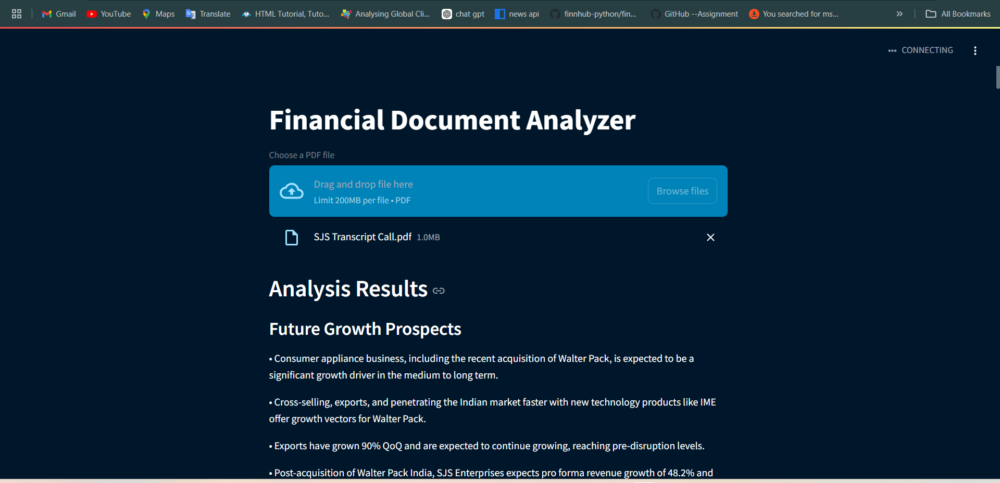
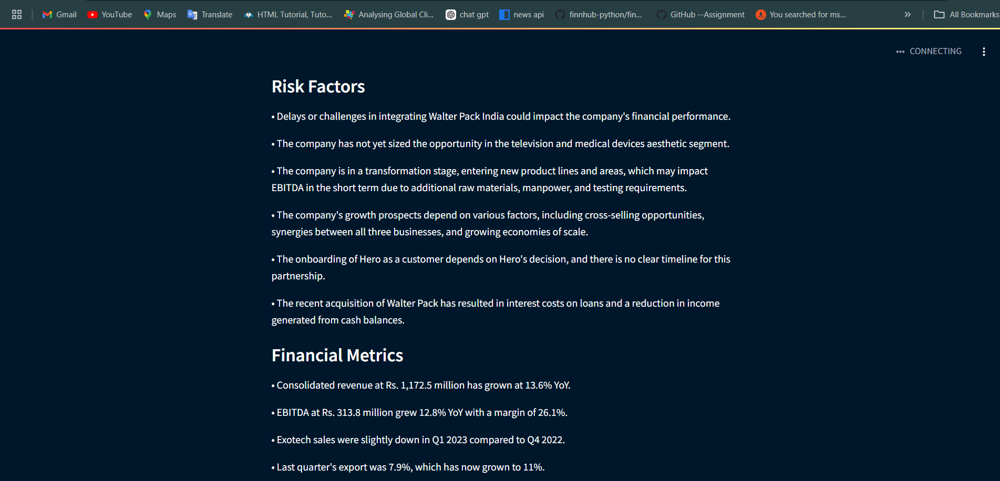

# Financial Document Analyzer

The Financial Document Analyzer is a Streamlit application that uses the GROQ API to analyze financial documents. It extracts key information relevant to investors, such as growth prospects, business changes, risk factors, and more. This tool is particularly useful for financial analysts, investors, and businesses looking for insights into company reports and financial statements.

## Table of Contents
- [Project Details](#project-details)
- [Features](#features)
- [Technologies Used](#technologies-used)
- [Setup Instructions](#setup-instructions)
- [Usage](#usage)
- [Result Output](#result-output)
- [Screenshots](#screenshots)
- [Project Video](#project-video)

---

## Project Details

The Financial Document Analyzer takes PDF files as input, extracts text data, splits it into chunks for processing, and analyzes each chunk using the GROQ API. The application provides structured insights that can guide investment and business decisions by highlighting:
- Future Growth Prospects
- Key Business Changes
- Important Triggers
- Material Information Affecting Future Earnings
- Risk Factors
- Financial Metrics
- Strategic Initiatives

### Objective
To automate the extraction and analysis of important information from financial documents, saving time and providing concise, actionable insights.

---

## Features
- **PDF Text Extraction:** Extracts text from uploaded PDF files.
- **Data Chunking:** Splits text data into manageable chunks for better API processing.
- **Automated Analysis:** Analyzes text using the GROQ API to extract key financial insights.
- **Structured Output:** Provides structured, categorized data for easy understanding and further use.

## Technologies Used
- **Python**
- **Streamlit**
- **GROQ API**
- **PyPDF2** for PDF text extraction
- **dotenv** for secure API key handling
- **Logging** for error handling and debugging

---
## Setup Instructions

**Set Up the GROQ API Key**

Create a .env file in the root directory.
Add your GROQ API key to the .env file:
GROQ_API_KEY=your_groq_api_key
**Run the Application Start the Streamlit app using:**
streamlit run app.py

## Usage
Upload a PDF file containing the financial document you want to analyze.
The app will process the document, analyze its content, and provide key insights in a structured format.
View the results, categorized by growth prospects, business changes, risk factors, etc.

## Result Output
**Analysis Results**

**Future Growth Prospects**
• Consumer appliance business, including the recent acquisition of Walter Pack, is expected to be a significant growth driver in the medium to long term.

• Cross-selling, exports, and penetrating the Indian market faster with new technology products like IME offer growth vectors for Walter Pack.

• Exports have grown 90% QoQ and are expected to continue growing, reaching pre-disruption levels.

• Post-acquisition of Walter Pack India, SJS Enterprises expects pro forma revenue growth of 48.2% and pro forma EPS growth of 51.8% YoY.

• SJS Enterprises aims to outperform the underlying industry growth rates by addressing the aesthetic requirements of multiple end industry segments, increasing global presence, introduction of new technology products and building mega customer accounts.

• SJS Enterprises is guiding for 20% - 25% organic growth in the mid-term.

• SJS Enterprises is maintaining its organic growth stance of 20% to 25% for FY24 to FY26.

• SJS has identified new age products like optical plastics and cover glass, which will further drive up the kit value supplied to customers.

• The acquisition of Walter Pack will contribute over and above the 20% -

• The company aims to increase its global presence and customer spread in the consumer appliances segment.

• The company believes that inorganic acquisitions will continue to be their core strategy for strengthening market leadership in the aesthetic business.

• The company expects to outperform the underlying industry growth, driven by recovery in the consumer sector in export markets.

• The company is confident of achieving growth targets in the medium term due to various cross-selling opportunities, synergies between all three businesses, and growing economies of scale.

• The company, S JS and Exotech, is expected to grow organically at a CAGR of 20% to 25%. Inorganic acquisitions will add to this growth above the mentioned range. However, specific growth guidance for Walter Pack could not be provided as the acquisition was recently completed.

• Walter Pack has a growth potential with large global companies like Whirlpool and Samsung, with whom S JS currently does not have any IML part business.

**Key Business Changes**
• Exotech sales were slightly down due to soft farm equipment demand and delays in launching new products for the sanitaryware segment.

• Pro forma numbers indicate that 36% revenue contribution would be from two-wheelers, 36% from passenger vehicles, and 28% from consumer appliances and others.

• Roy Mathew, one of the founders of Walter Pack India, will continue to spearhead Walter Pack with a 10% stake, ensuring seamless integration and harnessing optimum revenue synergies in the medium term.

• SJS Enterprises has completed the transformative acquisition of Walter Pack India within the set timeline.

• SJS Enterprises is trying to acquire strategic customers, both domestic and international, which will benefit the company in the mid to long term.

• The acquisition has opened up new opportunities for SJS Enterprises, enabling deeper penetration in passenger vehicles and consumer appliances segments, thereby reducing two-wheeler dependence.

• The company has added new product lines through acquisitions, such as Mabe group, IFB, and Walter Pack, which will contribute to growth in the future.

• The company has onboarded Foxconn for supplying aesthetics to their electric vehicles (EV) and has won a business for some decorative decals for the television industry.

• The company has seen an increase in subcontracting employees and a one-time expense in terms of a provision made for interest on GST.

• With Walter Pack acquisition, SJS Enterprises has acquired a large growth and high margin business at a good valuation, achieving strategic objectives in terms of addition of new and emerging technologies, new customers, manufacturing capabilities, and increased management bandwidth.

**Important Triggers**
• Exports initiatives, such as appointing sales agents in South America, are helping SJS Enterprises strengthen its presence in that region.

• Gradual pickup in demand in North America and Europe is expected to help the company grow further.

• SJS Enterprises added two marquee customers, Toyota Tsusho and Autoliv, to its portfolio, securing a large order of IML parts from Autoliv.

• The acquisition of Walter Pack provides additional growth opportunities.

• The company expects to see real-life IME parts in another 2-3 years.

• The company has been consistently growing ahead of the industry for 15 consecutive quarters.

• The in-mold electronics (IME) product is under development, with prototype build requirements for two-wheeler and four-wheeler applications.

• The potential onboarding of Hero as a two-wheeler OEM customer.

• The start of production for the Foxconn EV project in Q2.

• Walter Pack, Spain, will be the technology partner for implementing IME technology in SJS Enterprises' products in India.

**Material Information**
• At 60% to 70% capacity utilization, Walter Pack can generate revenue close to INR 200 crores. The full revenue potential at optimum utilization was not provided.

• Consumer durables have shown muted growth of around 2% - 3% and account for approximately 15% - 16% of sales.

• Equity share capital has increased to Rs. 310.38 million post preferential allotment to the promoter Mr. Joseph, increasing his overall shareholding from 15.5% to 16.9%.

• Exports have grown significantly, with the export revenue almost doubling this quarter compared to the same quarter last year.

• Post-acquisition of Walter Pack India, SJS Enterprises' cash and cash equivalent stands at Rs. 461.7 million, and the net debt has increased to Rs. 539.8 million.

• The addition of new technologies and subject matter experts for optical plastic, optical glass, and other new technologies will impact costs but increase the addressable market.

• The company has a confirmed order book of around 90% for FY24 for the SJS plus Exotech consolidated business, excluding WPI.

• WPI's order book is also around 90% confirmed for FY24.

**Risk Factors**
• Delays or challenges in integrating Walter Pack India could impact the company's financial performance.

• The company has not yet sized the opportunity in the television and medical devices aesthetic segment.

• The company is in a transformation stage, entering new product lines and areas, which may impact EBITDA in the short term due to additional raw materials, manpower, and testing requirements.

• The company's growth prospects depend on various factors, including cross-selling opportunities, synergies between all three businesses, and growing economies of scale.

• The onboarding of Hero as a customer depends on Hero's decision, and there is no clear timeline for this partnership.

• The recent acquisition of Walter Pack has resulted in interest costs on loans and a reduction in income generated from cash balances.

**Financial Metrics**
• Consolidated revenue at Rs. 1,172.5 million has grown at 13.6% YoY.

• EBITDA at Rs. 313.8 million grew 12.8% YoY with a margin of 26.1%.

• Exotech sales were slightly down in Q1 2023 compared to Q4 2022.

• Last quarter's export was 7.9%, which has now grown to 11%.

• Other expenses have increased due to an increase in subcontracting employees and a one-time expense for a provision made for interest on GST.

• PAT at Rs. 180 million grew 11.1% YoY with a PAT margin of 15.4%.

• ROCE during the quarter stands at 38.6%, and ROE at 14.5%.

• The company expects to grow organically at a CAGR of 20% to 25%.

• WPI revenue for this quarter grew 21% YoY to Rs 356 million.

• Walter Pack can generate revenue close to INR 200 crores at 60% to 70% capacity utilization.

**Strategic Initiatives**
• Acquiring strategic customers, both domestic and international, to benefit the company in the mid to long term.

• Entering the television and medical devices aesthetic segment.

• Expanding into new technology areas, such as optical plastic, optical glass, and IME technology.

• Pursuing the onboarding of Hero as a two-wheeler OEM customer.

• SJS Enterprises has deferred its chrome plating capacity expansion CAPEX plan by a year to calendar year '24.

• SJS Enterprises plans to grow customers into mega counts and expand its presence in the global market.

• Starting production for the Foxconn EV project in Q2.

• The company aims to create a more conducive strategy that can accommodate the changing needs and demands of both businesses.

• The company aims to prove its credentials with global companies in the Indian market and then penetrate their global networks.

• The company is focusing on quality, cost, and delivery to win customer confidence and introduce its products in more plants globally.

• The company is revising expansion plans to align more effectively with the evolving business requirements of both Walter Pack and Exotech.

## Screenshots
#### Home Page

#### Analysis Results

## Project Video

For a complete walkthrough of the project, watch this [project video](images/Video11.mp4) to see how the Financial Document Analyzer works in action.

